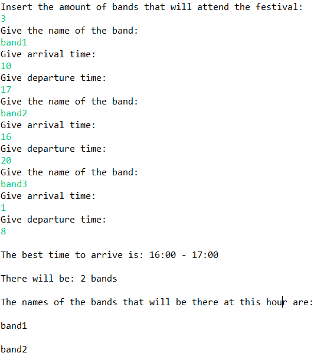
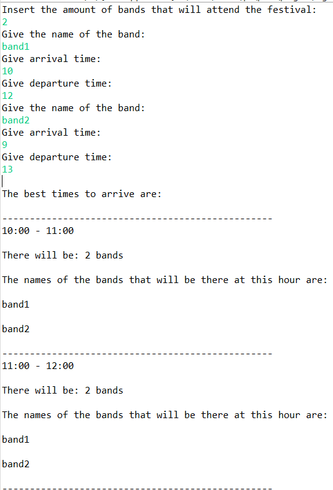
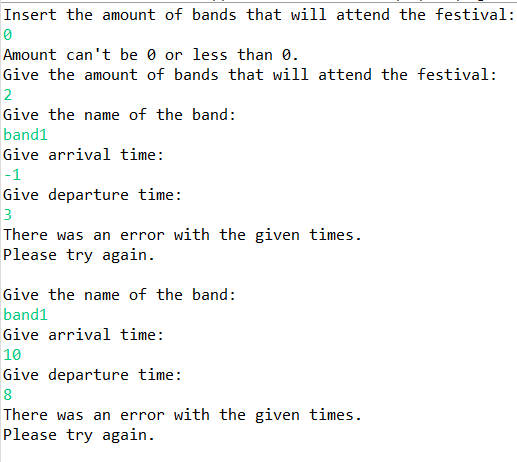

# BestTime
## Project

Let's say that you have a free ticket to a music festival but there is a catch, even though the festival is for 24 hours, you are only able to go for 1 hour. You must choose to arrive there when the most amount of bands will be there as you want to meet as many celebrities as you can. Which hours will you choose?

- The bands will arrive at the start of each hour (e.g. 10:00 not 10:15)
- The bands will depart 1 minute before the end of each hour (e.g. 11:59 not 12:00)
  - That means that the general rule is: "[Arrival, Departure)"

- A band can stay there as much time as they want
- The arrival time of a band can't be less than 0 or less than the departure time

The user inserts the amount of bands that will be in the festival. After that they insert each band name, arrival time and departure time. Then a message will appear on the screen with the best hour(s) to go to the festival.
## Screenshots

###### Errors

## UML

